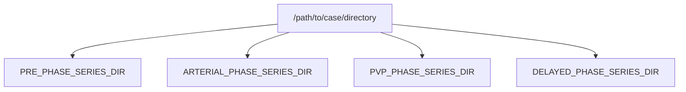
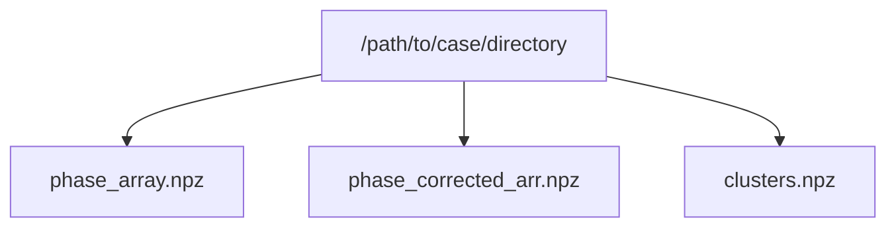

## Introduction

Automated liver segmentation methods often struggle to accurately segment the internal structures of the liver due to its complex anatomy and variable vascular spatial orientations. Manual segmentation and labeling of liver vascularity is time-consuming and requires expert input. The development of automated methods for liver vascular anatomy segmentation has been limited due to the difficulty and cost of producing large annotated datasets.

LiVaS is a semi-automated pipeline and user interface that allows for the quick segmentation and labeling of 3D liver vasculature from multiphase MR images.

## Prerequisites

Prior to using LiVaS software, ensure that the following is true for each case:
- pre-contrast, arterial, portal venous and delayed phase images are present for the case
- the liver outer contour is segmented on the pre- and post-contrast MR images
- post-contrast liver masks (populated with liver signal intensities) are registered to the pre-contrast liver mask (Figure 1)
- each pre- and post- contrast series are all located in their own directory within a parent case directory (*/path/to/case/directory* in further text). Here is an example directory structure:


![[Figure1_phase_images_case106428.png|680]]  
*Figure 1. Liver segmentation and registration. First row, left to right: pre-contrast, arterial phase, portal venous phase and delayed phase MR images. Second row: phase MR images after liver outer contour segmentation. Third row: phase MR images after post-contrast liver masks are registered to pre-contrast liver masks.*

Setup your environment to meet the following version requirements:
- python 3.8.5
- numpy 1.19.2
- pydicom 2.2.2
- scipy 1.5.2
- skimage 0.17.2
- SimpleITK 2.0.2
- faiss 1.6.5
- matplotlib 3.3.2

## Installation

### Setting up the LiVaS conda environment:
```bash
conda create --name LiVaS # create the LiVaS environment
conda env list # list all of the conda environments
conda activate LiVaS # activate the new environment
conda install python=3.8.5 # install python 3.8.5
python --version # confirm that the python version is 3.8.5
conda install numpy=1.19.2 # install numpy
conda install matplotlib=3.3.2
conda install scipy=1.5.2
pip install pydicom==2.2.2
pip install simpleitk==2.0.2
conda install -c conda-forge faiss=1.6.5
conda list # list all the packages in the environment
```

### Clone the LiVaS GitHub repository:
1. Crete a project directory on your computer (*/path/to/project/directory* in further text).
2. Clone the project repository:
```bash
cd /path/to/project/directory
git clone https://github.com/username/repo.git
```

## Usage

### Voxel clustering  
1. Navigate to project directory:
```bash
cd /path/to/project/directory
```
2. An example python code for voxel clustering:
```python
import sys
sys.path.append('/path/to/project/directory')
from LiVaS_helper import *

#-------------------------------------------------------------------------
# List containing search kewords to be used in sorting phase series.
# The order of search keys in the list should reflect the AP timing,
#  and should contain substrings of the relevant phase-directories' names.
sort_order_key_list = ["PRE","ARTERIAL", "PVP", "DELAYED"]

# directory where phase dicom subdirectories are located
dicom_dir = '/path/to/case/directory'

# run clustering for the case
voxel_clustering_pipeline( dicom_dir, sort_order_key_list )
```




The following file structure will be created:
- */path/to/case/directory*
	- *phase_array.npz* (4D numpy array of the original images)
	- *phase_corrected_arr.npz* (4D image array after bias field correction)
	- *clusters.npz* (resulting 3D voxel clusters array)

Where *.npz* file extension represents compressed Numpy array.

### User interface (UI) - Cluster selection and vascular labeling  
The LiVaS UI allows users to quickly browse through precomputed cluster configurations (see *Voxel clustering* above) and match cluster labels to corresponding vessel groups.
The UI can be launched with the following shell command:
```bash
python LiVaS_UI.py
```
The main UI window presents liver images and clustering outputs as three axial slices that can be scrolled through (Figure 2).  Once the user selects the number of clusters that best segment the liver vasculature, vessel groups are labeled using default keys for Portal Veins and Hepatic Veins, after which segmentation and labels are saved to disk.

![[LiVaS_UI_3.png]]  
*Figure 2. LiVaS User Interface (UI) window with 3 arterial axial slices: reference image (left), reference image with overlaid candidate cluster (center), and reference image with overlaid selected and labeled anatomy (right).*

### Output
LiVaS voxel clustering, as well as cluster selection and labeling, generate the following output files:
*/path/to/case/directory*
	- *phase_array.npz* (4D numpy array of the original images)
	- *phase_corrected_arr.npz* (4D image array after bias field correction)
	- *clusters.npz* (voxel clusters array )
	- *labels.npz* (3D labels array)

To use original phase image array along with vasculature labels array, the relevant files must be first loaded from disk:
```python
def load_NPZs(dicom_dir: str) -> Tuple[np.ndarray, np.ndarray]:
    with np.load(dicom_dir + '/phase_array.npz') as data:
        phase_array = data['phase_array']
    with np.load(dicom_dir + '/labels.npz') as data:
        labels = data['labels']
    return (phase_array, labels)

# directory where phase dicom subdirectories are located
dicom_dir = '/path/to/case/directory'
phase_array, labels = load_NPZs(dicom_dir)
```

## Authors
- Mladen Zečević
- Kyle Hasenstab
- Guilherme Moura Cunha